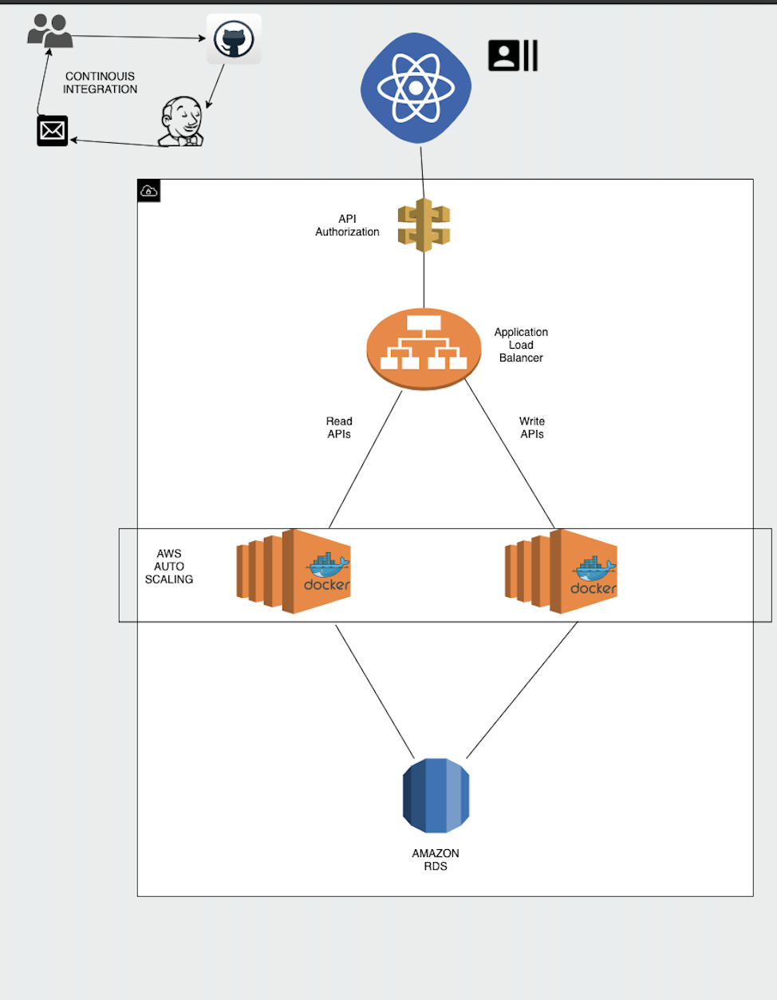
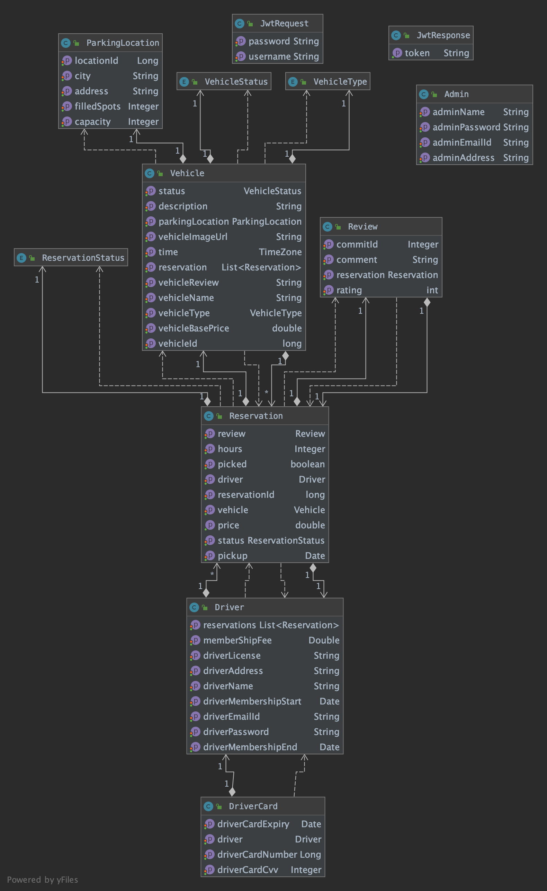
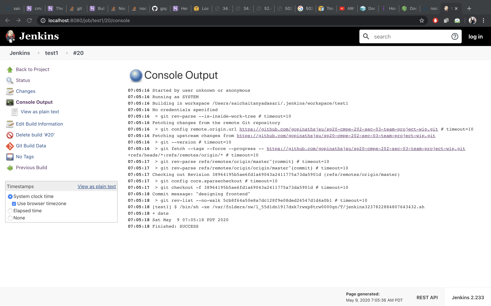

#  Car Hire Application for Anybody with a Driver's License

## Features 
I handled varying parts in the project including Admin module in backend and frontend, dockerized the whole application using Maven and deployed on AWS load balancer with Auto Scaling connecting to AWS RDS, and UI development along with CI with Jenkins, and documentation. Also handled the development of the entire Reservations + Reviews module including the functional APIs, Driver/Drivercard modules, integration and regression testing for backend, and documentation.The development of entire Vehicle and ParkingLocation modules at backend, API development for special functionalities like custom vehicle search, complete security module of the backend module using JWT, and testing of the backend APIs along with integration with frontend, and documentation.

## Abstract

We have developed a Spring MVC based web application to create a eco system where the users can book a car for a short trip/Weekend trip by registering into our application. We leveraged the java design patterns to develop a string backend that is deployed as an auto-scaled and load-balanced application on AWS. Frontend integration in ReactJS completes the end-to-end integration.

## Technology Stack
FrontEnd : React  
Backend : Java Springboot with Hibernate  
Testing: Postman  
Cloud Deployment: AWS Autoscaling with CloudWatch alarm, Docker, AWS ELB, AWS API Gateway

## Features

1. A new user can register into the system as a potential driver with his driver's license number and email ID. A driver when registered is automatically assigned 6-month membership with a fee of 50$. Driver can add as many credit cards as he wants to his account.

2. Admin role is implemented admin to add new vehicles with a custom hourly rental price, new locations, view users, and terminate membership of users. 

3. API exposed to terminate membership allows a user as well as an admin to terminate a user's membership

4. Vehicles have a base price defined in its properties. However, the final price of reservation is dynamic--with every additional 8 hours booked, the hourly price reduces by 1$. This is done by setPrice() method in Vehicle model. Vehicles have to added to a particular parking location

5. Each location has a set capacity of cars. Every time a vehicle is picked up or returned, the filled spots for the location accordingly increment or decrement. Returning a car also has a guard against returning vehicles at a location with already full spots. This brings to picture that vehicles can be booked from any location and returned at any location as long as it has a vacant parking spot.

6. In the application, a driver can browse for vehicles, vehicles at a location with custom searches.

7. Driver can place a reservation for a selected vehicle by selecting a time for pickup. The application needs no human intervention like zipcar as the driver himself can pick a vehicle and start his reservation on the application and end it on the application when he drops the vehicle off at a location. 

8. Reservations can be be placed by a user only if he does not have any ongoing reservations and the vehicle he selectced is available.

9. The driver is charged for the duration that the vehicle is picked up to return time. If the vehicle is returned back later than the drop off time, a late return fee is applied in addition to the rental fee.

10. When the vehicle is returned, user can also leave a feedback on the vehicle and leave a rating out of 5. An admin can view the feedback on this reservation and act upon it.

11. A driver can also cancel a reservation up to 1 hour ahead of the pickup time. If not, a one-hour rental is added to the price.

12. Hibernate ensures concurrency to ensures no 2 concurrent transactions will result in an incorrect read/write transaction. 

13. Admin and user roles ensure multi-user access. There could be multiple admins assuming various roles in the application like manager, salesperson etc.

14. ReactJS ensures we have a simple and light-weight UI.

15. Data for the application is stored and accessed from a AWS RDS database persistently. Since our data is simple and structured in a predictable manner, we chose to use MySQL as our primart database over NoSQL databases.

## Cloud Architecture

 ## UML DIAGRAM

## Backend Services
We will be using SRPING MVC Java APIs to fetch the values from the Models. Since our application will render information on run-time, the non-blocking asynchronous nature of JAVA will help us get good performance.

## Client Side
Frontend is built on ReactJS as it is a light-weight library built over JavaScript, which doesn't re-render the entire DOM on change of components on the browser, rather it just re-renders the changed components. Hence ReactJS would improve application performance

## Continous Integration 

We used Jenkins for our continous integration purpose when we push the code to the githib Jenkins runs the build and tells the status of the build if it fails via Email.

## Documentation  

### Sprint Task Sheet
Folder: Documentation/Cmpe202 Sprint Task Sheet.xlsx

### Project journal
Folder: Documentation/ProjectJournal.md

### XP Values
Folder: Documentation/XPValues.md

### UI Wireframes
Folder: Documentation/UI Wireframes

### Design Doc
https://docs.google.com/document/d/1DM46SGXyhCMIH70hC72ufU-x_5uT-EtUg1gDs10Lwmk/edit
